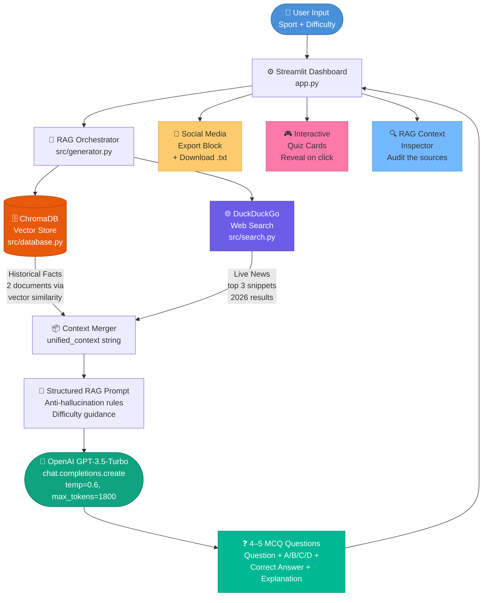

# 🏆 AI-Powered Sports Quiz Generation Agent

[](https://www.python.org/)
[](https://streamlit.io)
[](https://www.trychroma.com/)
[](https://openai.com/)
[](https://opensource.org/licenses/MIT)

> An intelligent AI agent that automatically generates **fact-checked, hallucination-resistant** multiple-choice sports quizzes for social media — powered by **Retrieval-Augmented Generation (RAG)** using ChromaDB, DuckDuckGo, and OpenAI GPT.

---

## 🗺️ System Architecture Flowchart



### How data flows through the system

```
[User: "Cricket, Hard"]
        │
        ▼
┌──────────────────────┐
│  Streamlit app.py    │  ←─ Entry point; manages UI, session state, display
└──────────┬───────────┘
           │
           ▼
┌──────────────────────┐
│  generator.py (RAG)  │  ←─ Orchestrates both retrieval paths
└──────┬───────┬───────┘
       │       │
       ▼       ▼
┌──────────┐  ┌──────────────────┐
│ ChromaDB │  │  DuckDuckGo Web  │
│ database │  │  Search (live)   │
└────┬─────┘  └────────┬─────────┘
     │                  │
     │  (Historical)    │  (Live 2026 news)
     └────────┬─────────┘
              │
              ▼
   ┌──────────────────────────┐
   │  Unified RAG Context     │
   │  === HISTORICAL FACTS === │
   │  === LIVE INTERNET NEWS ==│
   └──────────┬───────────────┘
              │
              ▼
   ┌──────────────────────────┐
   │  OpenAI GPT-3.5-Turbo    │
   │  (reads ONLY the context)│
   └──────────┬───────────────┘
              │
              ▼
   ┌──────────────────────────┐
   │  4–5 MCQ Questions       │
   │  Displayed in Streamlit  │
   └──────────────────────────┘
```

---

## ✨ Key Features

| Feature | Description |
|---|---|
| 🏅 5 Sports | Cricket, Football, Tennis, Badminton, Basketball |
| 🎯 3 Difficulty Levels | Easy, Medium, Hard with LLM-aware per-level guidance |
| 🗄️ ChromaDB Vector Store | 18 curated offline facts with sport-level metadata filtering |
| 🌐 Live Web Search | Fetches 2026 tournament news with dual fallback queries |
| 🧠 RAG-Grounded LLM | Generates 4–5 MCQs strictly from retrieved context only |
| 📲 Social Media Export | One-click text area copy + `.txt` download button |
| 🎮 Interactive Quiz Mode | Per-question expandable reveal cards with explanations |
| 🔍 RAG Inspector | Transparency panel showing exactly what the AI read |
| ♻️ Regenerate Anytime | Click **Generate Fresh Quiz** for a new set every time |
| 🗑️ Clear Quiz | Instantly wipe and start fresh with Clear button |

---

## 🛠️ Tech Stack

| Layer | Library | Version | Purpose |
|---|---|---|---|
| Frontend | `streamlit` | ≥ 1.30.0 | Interactive web dashboard |
| Vector DB | `chromadb` | ≥ 0.4.22 | Local persistent vector store |
| Embeddings | `sentence-transformers` | ≥ 2.3.0 | Text-to-vector conversion |
| Web Search | `duckduckgo-search` | ≥ 4.4.1 | Free, keyless live web search |
| LLM SDK | `openai` | ≥ 1.10.0 | GPT-3.5-Turbo quiz generation |
| Config | `python-dotenv` | ≥ 1.0.1 | Safe `.env` API key management |

---

## 📋 Prerequisites

- **Python 3.9, 3.10, or 3.11**
  > ⚠️ Python 3.12+ is **NOT supported** — ChromaDB C-extensions require 3.9–3.11.
- An **OpenAI API Key** → [Get one here](https://platform.openai.com/api-keys)
- `git` installed on your machine

---

## 🚀 Installation & Setup

### Step 1 — Clone the repository

```bash
git clone https://github.com/YOUR_USERNAME/sports-quiz-agent.git
cd sports-quiz-agent
```

### Step 2 — Create and activate a virtual environment

```bash
# Windows (Command Prompt / PowerShell)
python -m venv venv
venv\Scripts\activate

# macOS / Linux
python3 -m venv venv
source venv/bin/activate
```

You should see `(venv)` appear at the start of your terminal prompt.

### Step 3 — Upgrade pip and install all dependencies

```bash
pip install --upgrade pip
pip install -r requirements.txt
```

> ℹ️ `sentence-transformers` will download a ~90 MB embedding model on first run — this is normal.

### Step 4 — Create your `.env` file and add your API key

```bash
# Copy the safe template
cp .env.example .env
```

Then open `.env` in any text editor and replace the placeholder:

```
OPENAI_API_KEY=sk-proj-YOUR_ACTUAL_OPENAI_API_KEY_HERE
```

> 🔒 `.env` is already listed in `.gitignore` — it will never be committed to GitHub.

### Step 5 — Run the application

```bash
streamlit run app.py
```

The app opens automatically in your browser at `http://localhost:8501`.

---

## 📁 Project Structure

```
sports-quiz-agent/
│
├── .env                    🔒  Your secret API keys (never commit!)
├── .env.example            ✅  Safe-to-share key template
├── .gitignore                  Files excluded from Git tracking
├── requirements.txt            Python dependency list
├── README.md                   This file
│
├── app.py                  🖥️  Streamlit dashboard — entry point
│
├── data/
│   └── sports_facts.json   📚  18 curated historical sports facts
│
├── chroma_db/              🗄️  Auto-created by ChromaDB (do not edit)
│
└── src/
    ├── __init__.py             Marks src/ as a Python package
    ├── config.py               Loads .env variables (API keys)
    ├── database.py             ChromaDB: store & query vector facts
    ├── search.py               DuckDuckGo: live web search
    └── generator.py            RAG orchestrator: context → prompt → LLM → quiz
```

---

## 📤 Expected Output Format

```
Sport: Badminton
Difficulty: Medium

Question: Which country won the Thomas Cup in 2022?
A) Indonesia
B) India
C) China
D) Denmark
Correct Answer: B
Explanation: India won its historic first Thomas Cup title in 2022 by defeating
             Indonesia 3-0 in the final, as stated in the historical facts context.
---
```

---

## 🔧 Troubleshooting

### ❌ ChromaDB SQLite error on Windows / older Linux

```
RuntimeError: Your system has an unsupported version of sqlite3.
```

**Fix — Step 1:** Install the compatible binary:

```bash
pip install pysqlite3-binary
```

**Fix — Step 2:** Add these three lines to the **very top** of `src/database.py`
(above all other imports):

```python
__import__('pysqlite3')
import sys
sys.modules['sqlite3'] = sys.modules.pop('pysqlite3')
```

### ❌ OpenAI authentication error

```
openai.AuthenticationError: Incorrect API key provided
```

**Fix:** Check that your `.env` file in the project root contains:

```
OPENAI_API_KEY=sk-proj-YOUR_ACTUAL_KEY
```

> ⚠️ If you accidentally pushed your key to GitHub, OpenAI auto-revokes it instantly.
> Generate a new key at [platform.openai.com/api-keys](https://platform.openai.com/api-keys).

### ❌ DuckDuckGo returns no results

The app automatically tries a secondary fallback query, and if that also fails,
injects a synthetic context string — so quiz generation will still complete.
No action needed.

### ❌ No facts returned for a sport

Ensure the sport name in the dropdown **exactly matches** the `"sport"` field
in `data/sports_facts.json` (case-sensitive: `"Cricket"` not `"cricket"`).

### ❌ sentence-transformers download is slow

This is a one-time ~90 MB model download on the very first run.
Subsequent runs load from the local cache instantly.

---

## 🔐 Security Checklist

- [x] `.env` is listed in `.gitignore` — will never be pushed to GitHub
- [x] `chroma_db/` is listed in `.gitignore`
- [x] `venv/` is listed in `.gitignore`
- [x] No API keys are hardcoded anywhere in the source code
- [x] `.env.example` provides a safe template with a placeholder only

---

## 📜 License

This project is licensed under the **MIT License**.

---

*Built for the Statupbox AI Product/Engineer Intern Assignment — July 2026.*
